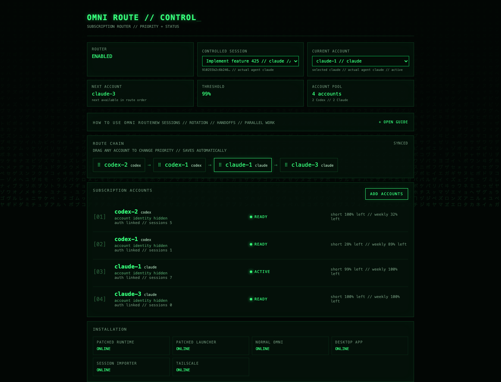
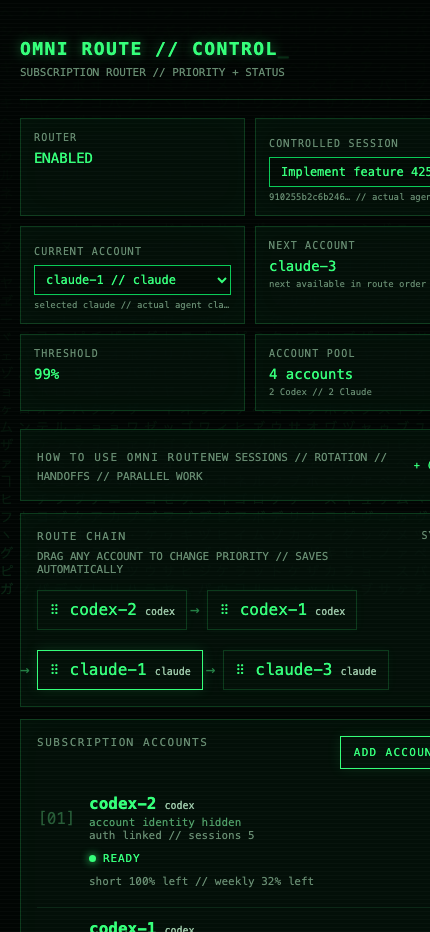

# Omni Route / Omnigent Subscription Rotation

Omni Route is a macOS extension around Omnigent that rotates one routed coding
session across any number of ChatGPT/Codex and Claude subscription accounts in one
ordered pool. It uses the official Codex/Claude CLI subscription
logins; it does not convert subscriptions into API keys.

> **Coding agents:** read [`AGENT_HANDOFF.md`](AGENT_HANDOFF.md) completely before modifying this repository. It contains the canonical product context, architecture decisions, invariants, testing expectations, and repository workflow.

## Full install

```bash
git clone git@github.com:Sevastian-Bahynskyi/omni-route.git
cd omni-route
./install_all.sh
```

`install_all.sh` installs/updates the normal Omnigent CLI, Omnigent Desktop app,
required shared dependencies when missing, and Omni Route. `install.sh` can be
used when normal Omnigent/Desktop are already present.

Tailscale is installed automatically when missing so secure remote dashboard
access is available without a separate install step. Tailscale account sign-in
and connection are still explicit user actions.

During account setup, enter `codex` or `claude` once per subscription, then
`done`. Either provider can be first, and Claude-only pools are supported.
Each login gets a separate named profile; rerunning setup preserves existing
accounts, route settings, cooldowns and session bindings. Existing Claude
fallback configuration migrates to a regular `claude-legacy` profile.

Codex uses isolated `CODEX_HOME` credentials. Claude uses isolated
`CLAUDE_CONFIG_DIR` profiles, including distinct macOS Keychain entries as
documented in [Claude Code authentication](https://code.claude.com/docs/en/authentication).
When a Claude session starts, Omni Route records workspace trust inside the
selected account profile so Claude Code cannot strand the session on its
interactive trust prompt. It also links the shared `~/.agents/skills` catalog
into every isolated Claude profile, making workflow commands such as
`/implement` available under each subscription account.
Use a current Claude Code release. Normal CLI logins remain unchanged.

## Native desktop path

Omni Route now supervises the **native desktop apps** rather than replacing them:
Codex runs in ChatGPT.app and Claude in Claude Desktop, with their own skills,
plugins, browser and remote control intact. Omni Route manages accounts, quota,
rotation and the dashboard, and nothing else.

```bash
omni-rotate start               # launch the selected account and supervise it
omni-rotate native doctor       # check the native path end to end
omni-rotate native usage        # live quota for every account
omni-rotate native threshold 90 # set the switch threshold (maximum 95)
omni-rotate native rotate       # rotate accounts now
omni-rotate native signin NAME  # open an account profile to sign in
omni-rotate native status       # routing status as JSON
```

Each Claude account needs a one-time sign-in in its own desktop profile, because
Claude Desktop keeps its account in its Electron user-data directory rather than
in `CLAUDE_CONFIG_DIR`. `omni-rotate native signin <account>` opens that profile;
a new profile always starts signed out, which is expected. An account already
signed into the app's default profile can point at it with
`desktop_user_data_dir` in the pool config instead of being signed in twice.

Codex accounts need no sign-in: the account follows `auth.json` in the shared
`CODEX_HOME`, so rotation swaps the credential and leaves every session in place.

### Thresholds

The switch threshold is set from the dashboard or the CLI and **cannot exceed
95%**. Preparation always begins 3 percentage points earlier: at 95% the agent is
told to wind down at 92%, and rotation happens at 95%. The 5-hour window is the
primary signal; the weekly window also trips the threshold so a week-long
exhaustion cannot strand a session. A quota reading that cannot be taken counts
as unknown and never triggers a rotation.

### How a rotation works

1. At the preparation threshold the agent is told to finish its current unit and
   start nothing long.
2. At the switch threshold a `Stop` hook fires at a real turn boundary: the agent
   commits work in progress and writes a handoff.
3. The supervisor selects the next account, stops the app, swaps the credential
   or profile, and restarts.
4. A self-gating automation in the new account picks the handoff up and continues.
5. The rotation counts as successful only once the handoff marker is released --
   never because a schedule fired.

Wrong-account, missing-session, exhausted-pool and login-required cases stop
visibly instead of continuing silently.

## Legacy Omnigent path

The original Omnigent-routed path is still available while the native path
finishes proving itself:

```bash
omni-rotate omnigent    # start the legacy Omnigent-routed session
omni-rotate legacy-test # the old diagnostics
omni-rotate sessions    # import/re-sync Codex + Claude local history
```

## Commands

Installation adds `omni-rotate` to PATH:

```bash
omni-rotate start       # start the routed session in the native desktop apps
omni-rotate native ...  # native controls (see above)
omni-rotate test        # check the native path
omni-rotate status      # open the local control dashboard
omni-rotate accounts    # add/configure subscriptions
omni-rotate help
```

`omni-rotate codex` remains an alias for `omni-rotate start`.

## Control dashboard

The dashboard runs on `http://127.0.0.1:8787/` and opens automatically after a
successful `install.sh`.





It shows account emails/status, the automatic route chain, current routed
provider, installation health and diagnostics. Accounts from either provider can be dragged in
the route chain; the saved order is the actual priority used for new account
selection and quota failover.

The **Current account** dropdown switches the latest routed Omnigent session
without changing route priority:

- Codex account -> another Codex account: waits for the current turn to become
  idle, binds the requested subscription and relaunches the same session.
- Codex -> selected Claude account: uses Omnigent's native agent switch after the turn is idle.
- Claude -> Codex: binds the selected Codex subscription and switches the same
  Omnigent session back to `codex-native-ui`.
- Claude account -> another Claude account: relaunches with the selected isolated login.

A stopped/resumable Codex session can also have its next Codex account selected;
the binding is used when that session resumes.

### Optional Tailscale remote access

The **Remote Access** section enables two tailnet-only HTTPS proxies:

- **Dashboard link**, port `8443`, opens the account-control dashboard in a browser.
- **Server link**, port `8444`, goes to Omnigent on local port `6767`. Paste this link into the Omnigent phone app's Server URL field.

Connect Tailscale on the phone to the same network as the Mac. Keep the Mac
awake, online, and running Omnigent. Access is restricted by your tailnet access
policy; devices permitted to reach these ports can use the proxied local services.

On first use, Tailscale may require approval to enable Serve and HTTPS for the
network. The dashboard shows **Approve Tailscale Serve** instead of silently
waiting. Complete that step, then click Enable again. Links appear only after
the corresponding proxy is enabled. Errors remain visible across refreshes.

The dashboard and Omnigent continue listening on loopback. Tailscale terminates
HTTPS. No Funnel or public-internet exposure is enabled. Existing unrelated
Serve routes are not overwritten.

Omni Route synchronizes the exact server URL into Omnigent's trusted-origin
allowlist. This keeps browser multipart requests and WebSocket connections working
through Tailscale while preserving the local server's cross-site request guards.
The installer refreshes the allowlist and restarts the patched daemon after every
installation; enabling or disabling remote access updates it automatically.

## Session history import

Every install automatically scans local Codex and Claude histories and imports
them into Omnigent. You can rerun it at any time:

```bash
omni-rotate sessions
```

The importer:

- scans normal `~/.codex`, every registered Omni Route Codex account home, the
  active Claude config home, and registered Omni Route Claude account homes;
- uses Omnigent's own Codex/Claude transcript normalizers, preserving native
  titles, workspaces and resumable external session IDs;
- creates/reuses first-class Omnigent projects by transcript workspace/cwd, so
  sessions from the same repository are grouped together;
- excludes Codex subagent sessions by session metadata and Claude subagent transcripts;
- deduplicates shared Codex thread IDs across different account homes;
- when shared copies differ, normalizes all copies and keeps the richest
  transcript (most items, then newest/largest copy);
- treats already-imported sessions as existing instead of creating duplicates.

## Routing behavior

New sessions use the first available account for the provider selected in
OmniAgent. Automatic quota rotation first tries every available account for the
session's current provider. If none remain, it changes to the next available
provider account, keeps the same Omnigent session and workspace, and sends a
continuation handoff through the new native harness. The router reports exhaustion
only when every configured subscription is unavailable.

Manual dashboard provider switches do not mark an account exhausted. A manual
cross-provider switch sends the same continuation handoff as automatic fallback.

## Cleanup

Remove only Omni Route:

```bash
./uninstall.sh
```

Full Omnigent + Desktop + Omni Route cleanup:

```bash
./uninstall_all.sh
# or
./uninstall_all.sh --yes
```

The full cleanup keeps unrelated shared tools such as Homebrew, Git, `uv`,
`tmux`, Node, Codex CLI, Claude CLI and Tailscale.
